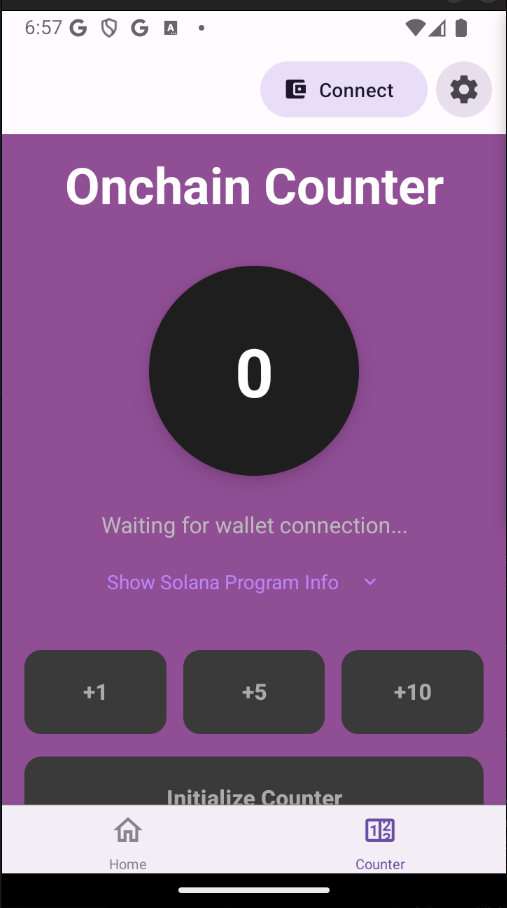
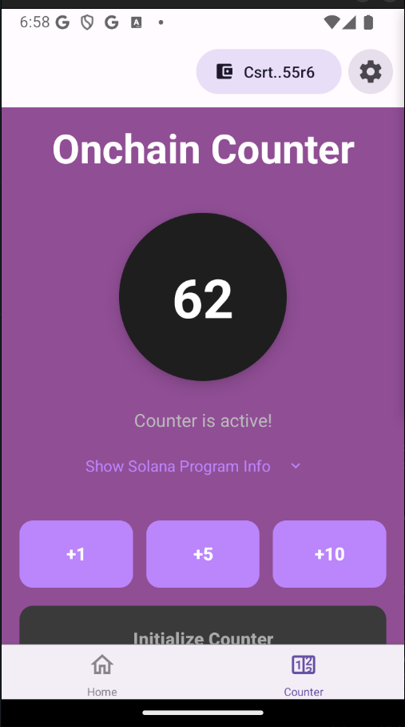
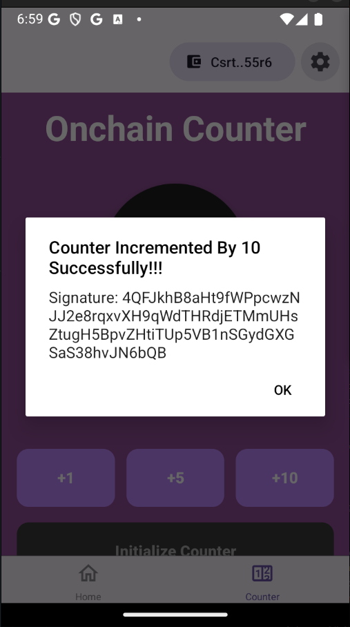
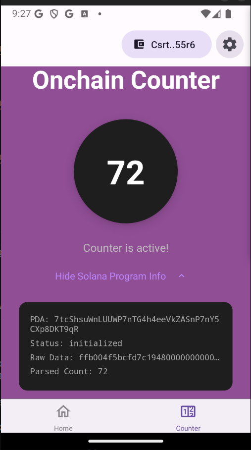
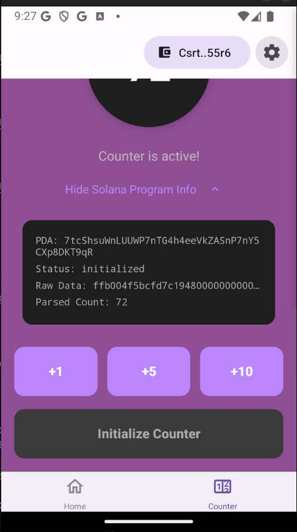
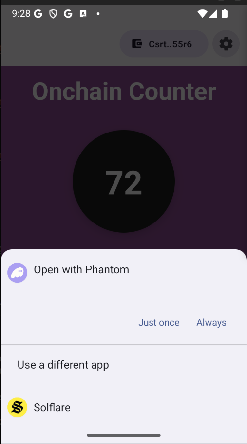

# Solana Mobile Anchor Counter dApp React Native Expo Template

# Demo
<table>
  <tr>
    <td align="center">
      
    </td>
    <td align="center">
      
    </td>
    <td align="center">
      
    </td>
  </tr>
</table>
<table>
  <tr>
    <td align="center">
      
    </td>
    <td align="center">
      
    </td>
    <td align="center">
      
    </td>
  </tr>
</table>

# About 
This template is for learning how to integrate Solana Anchor Programs into React Native Expo project.

You will learn to build a counter program in rust and deploy on Solana devnet. Then create a screen to interact with it in a react native expo app.

To learn how this was built step by step. Kindly watch the course here:

[Solana Mobile Development Course 002 | Build Anchor Counter Mobile dApp With React Native Expo](https://www.youtube.com/watch?v=QZ0tMBqGlkE)

# Solana Mobile React Native Expo dApp Template
This project is built off of the [Solana Mobile React Native Expo dApp Template](https://github.com/dProgrammingUniversity/solana-mobile-react-native-expo-dapp-template) which already have Solana Mobile Wallet Adapter, Web3js and other essential things to integrate with Solana Mobile in your react native expo app added.